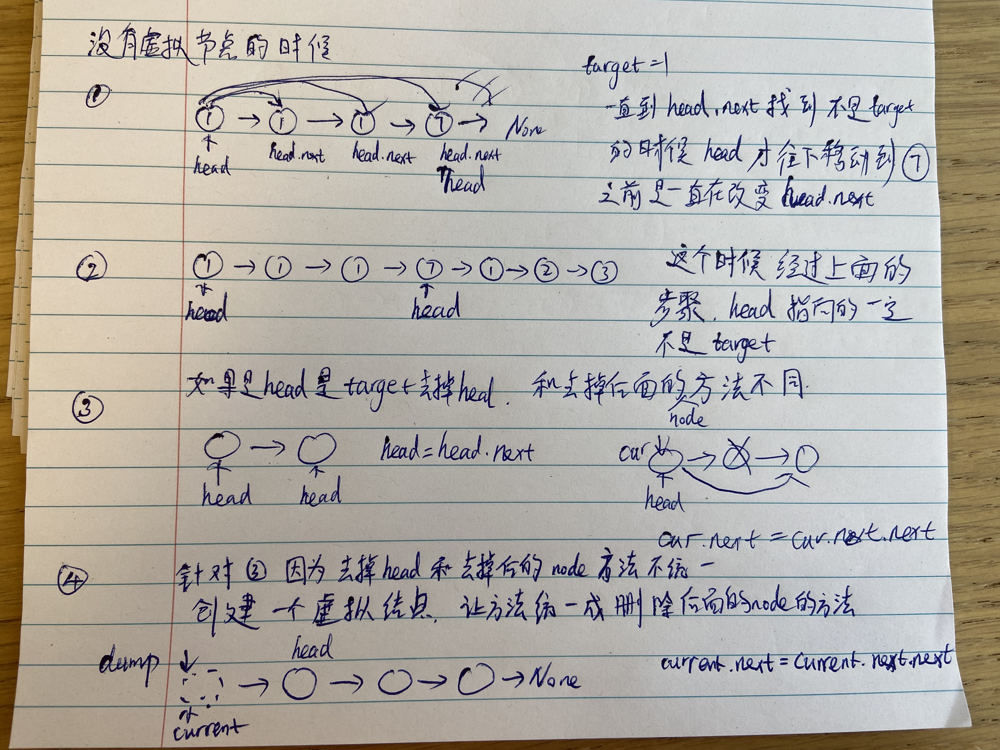

## 链表

### 1.移除链表 #203

心得体会：
- 去掉head，判定只要head等于target就一直执行while，一直到head不等于target，这时候在执行下面时候，head一定不是target，可以放心用next
- **while(current.next)的时候，如果满足条件也就是current.next==target，只改变了current的next指向哪里，但是current并没有改变指向的位置，再进入下次循环，仍然判定的是current的next是不是target，一直到current的next不再是target了，current才往下移动一位，为了删除连续是target的情况**
- 一定要定义一个临时指针做循环，不能用head改变，因为head一旦改变就找不回去了。
- 为什么要用虚拟节点？因为在删除头节点和后面的节点方法是不一样的。
<!--  -->


## 这是没有虚拟节点的方法
```python
while head is not None and head.val == val :
    head = head.next

current = head
while current is not None and current.next is not None:
    if current.next.val == val:
        current.next = current.next.next
    else:
        current = current.next

return head
```

## 这是有虚拟节点的方法
```python
dummy_head = ListNode(-1)
dummy_head.next = head
# 定义一个临时指针
current = dummy_head

while current.next is not None:
    
    if(current.next.val != val):
        current = current.next
    else:
        current.next = current.next.next
        

return dummy_head.next
```

### 2.设计链表 #707


## 没有虚拟节点的方法
```python
class MyLinkedList:

    def __init__(self):
        # Initialize your date structure here
        self.head = None
        self.size = 0


    def get(self, index: int) -> int:
        # Get the value of the index-th node in the linked list. If the index is invalid, return -1.
        if index >= self.size or index < 0:
            return -1
        current = self.head   

        for _ in range(0, index):
            
            current = current.next

        return current.val


    def addAtHead(self, val: int) -> None:
        # self.addAtIndex(0, val)
        current = self.head
        new_node = ListNode(val)
        new_node.next = current
        self.head = new_node


        self.size += 1

    def addAtTail(self, val: int) -> None:
        # self.addAtIndex(self.size, val)
        
        new_node = ListNode(val)
        if(self.head is None):
            self.head = new_node
        else:
            current = self.head       
            for _ in range(0, self.size-1):
                current = current.next
            current.next = new_node
        
        self.size += 1

    def addAtIndex(self, index: int, val: int) -> None:
        # index is greater that the length, the node will not be inserted
        if(index > self.size):
            return 
        new_node = ListNode(val)
        current = self.head
        if index <= 0:
            new_node.next = current
            self.head = new_node
        else: 
            # 找到index对应的node
            for _ in range(0,index-1):
                current = current.next

            # 在index之前插入新node
            new_node.next = current.next
            current.next = new_node 

        self.size += 1

        

    def deleteAtIndex(self, index: int) -> None:
        # if index is larger than size, or -1
        if (index > self.size-1 or index < 0):
            return
        
        
        current = self.head
        if index == 0:
            self.head = self.head.next
        else:
            for _ in range(0, index-1):
                current = current.next

            current.next = current.next.next
        self.size -= 1
```

## 有虚拟节点的方法,代码随想录里面的，看完视频，刷的时候一遍过，happy^_^
```python
class MyLinkedList:

    def __init__(self):
        # Initialize your date structure here
        self.dummy_head = ListNode()
        self.size = 0


    def get(self, index: int) -> int:
        # Get the value of the index-th node in the linked list. If the index is invalid, return -1.
        if index >= self.size or index < 0:
            return -1
        current = self.dummy_head.next   
        for _ in range(0, index):
            current = current.next

        return current.val


    def addAtHead(self, val: int) -> None:
        # self.addAtIndex(0, val)
        new_node = ListNode(val)
        head = self.dummy_head.next
        self.dummy_head.next = new_node
        new_node.next = head
        self.size += 1

    def addAtTail(self, val: int) -> None:
        # self.addAtIndex(self.size, val)
        
        new_node = ListNode(val)
        cur = self.dummy_head
        for _ in range(self.size):
            cur = cur.next
        cur.next = new_node 
        self.size += 1

    def addAtIndex(self, index: int, val: int) -> None:
        # index is greater that the length, the node will not be inserted
        if(index > self.size):
            return 
        new_node = ListNode(val)
        current = self.dummy_head
        for _ in range(index):
            current = current.next
        temp = current.next
        current.next = new_node
        new_node.next = temp
        

        self.size += 1


    def deleteAtIndex(self, index: int) -> None:
        # if index is larger than size, or -1
        if (index > self.size-1 or index < 0):
            return
        cur = self.dummy_head
        for _ in range(index):
            cur = cur.next
        cur.next = cur.next.next
        self.size -= 1

```

### 3.反转链表 #206

思路: 双指针解法，就是改变每一个node的指向，从指向后一个变成指向前一个，递归的写法，完全是按照双指针的输入和输出做出来的。

```python
def reverseList(self, head: Optional[ListNode]) -> Optional[ListNode]:

    pre = None
    current = head
    while current is not None:
        n = current.next
        current.next = pre
        pre = current
        current = n

    return pre

# 第二种递归的解法
    return self.reservs(None, head)

def reservs(self, pre, current):
        if current is None: 
            return pre
        temp = current.next
        current.next = pre
        return self.reservs(current, temp)
        

```