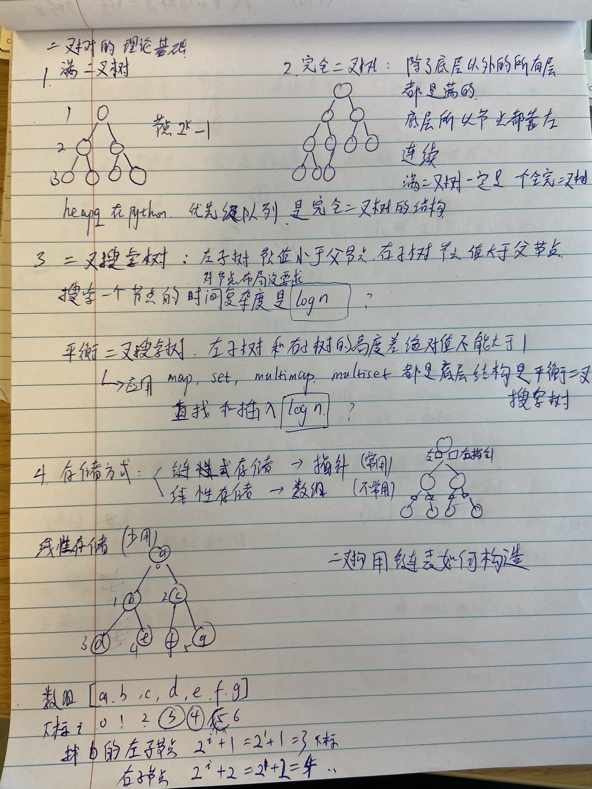
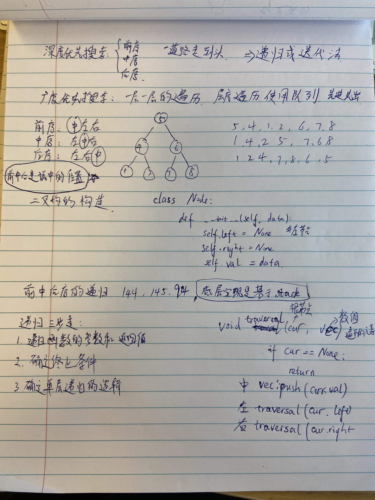

## Tree

### 1. 理论基础

### **二叉树的种类**
1. 满二叉树：没有节点都有两个子节点，也可以说深度为k，有2^k-1个节点的二叉树
2. 完全二叉树：除了最底层节点可能没填满外，其余每层节点数都达到最大值，并且最下面一层的节点都集中在该层最左边的若干位置。上一节里面的heap就是一个基于完全二叉树结构的函数
3. 二叉搜索树：二叉搜索树是一个有序树
    - 若它的左子树不空，则左子树上所有结点的值均小于它的根结点的值；
    - 若它的右子树不空，则右子树上所有结点的值均大于它的根结点的值；
    - 它的左、右子树也分别为二叉排序树
4. 平衡二叉搜索树： 又被称为AVL（Adelson-Velsky and Landis）树，它是一棵空树或它的左右两个子树的高度差的绝对值不超过1，并且左右两个子树都是一棵平衡二叉树。map、set的底层实现都是平衡二叉搜索树，所以map、set的增删操作时间时间复杂度是logn

### **二叉树的存储方式**
- 链式存储，用指针，通过指针把分布在各个地址的节点串联一起
- 顺序存储，用数组，顺序存储的元素在内存是连续分布的

### **二叉树的遍历方式**
- 深度优先遍历：先往深走，遇到叶子节点再往回走。
    - 前序遍历（递归法，迭代法）***中左右***，其实指的就是“中”决定是什么序
    - 中序遍历（递归法，迭代法）***左中右***，其实指的就是“中”决定是什么序
    - 后序遍历（递归法，迭代法）***左右中***，其实指的就是“中”决定是什么序
    - 经常会使用递归的方式来实现深度优先遍历，也就是实现前中后序遍历，使用递归是比较方便的。栈其实就是递归的一种实现结构，也就说前中后序遍历的逻辑其实都是可以借助栈使用递归的方式来实现的。
- 广度优先遍历：一层一层的去遍历。
    - 广度优先遍历的实现一般使用队列来实现，这也是队列先进先出的特点所决定的，因为需要先进先出的结构，才能一层一层的来遍历二叉树。

### **二叉树的定义**
就是定义一个指针，指向左右子节点，还有自己的值, 左右指针的初始值是None
```python
class TreeNode:
    def __init__(self, val, left=None, right=None):
        self.val = val
        self.left = left
        self.right = right
```

### 2. 递归遍历 #144, #145, #94

### 递归的三个要素
1. 确定递归函数的参数和返回值： 确定哪些参数是递归的过程中需要处理的，那么就在递归函数里加上这个参数， 并且还要明确每次递归的返回值是什么进而确定递归函数的返回类型。

2. 确定终止条件： 写完了递归算法, 运行的时候，经常会遇到栈溢出的错误，就是没写终止条件或者终止条件写的不对，操作系统也是用一个栈的结构来保存每一层递归的信息，如果递归没有终止，操作系统的内存栈必然就会溢出。

3. 确定单层递归的逻辑： 确定每一层递归需要处理的信息。在这里也就会重复调用自己来实现递归的过程。
#144 
```python
class Solution:
    def preorderTraversal(self, root: Optional[TreeNode]) -> List[int]:
        # 卡哥写法
        if not root:
            return []

        left = self.preorderTraversal(root.left)
        right = self.preorderTraversal(root.right)

        return  [root.val] + left +  right #前序
        return  left + [root.val] +  right #中序
        return  left +  right + [root.val] #后序
        # 递归解法，自己写的顺序，先定义了一个traversal函数
        res = []
        def traversal(root, res):
            if root == None:
                return
            res.append(root.val)        # 写在上面就是中左右，前序
            traversal(root.left, res)   # left
            res.append(root.val)        # 写在中间就是左中右，中序
            traversal(root.right, res)  # right
            res.append(root.val)        # 写在下面就是左右中，后序
        traversal(root, res)
        return res
```

思路：
```
    1
   / \
  2   3
     / \
    4   5
```
对于卡哥的写法return  [root.val] + left +  right，其实是决定了，什么时候写进去节点值，对于这个例子，等遍历到左右都是空时，就是2的时候，直接写进去1，2，再次遍历到4时，写进去4，3， 最后是5
如果是return  left + [root.val] +  right，遍历到2时，先写不为空的2，1，然后是遍历到4时，写进去4，3，最后是5
如果是return  left + right + [root.val]，如果是这种情况，就要遍历到左不为空2，先写入，然后是右边开始遍历，到4时，不为空再写入4，之后等右边不为空，写入5，之后才到了root.val为3，最后是1
总结来说就是上面两句决定，left和right要遍历到空时，再写入，顺利由return决定，我自己的写法更容易理解

### 3. 迭代遍历 #144, #145, #94

### 前序遍历迭代法：
前序遍历是中左右，每次先处理的是中间节点，那么先将根节点放入栈中，然后将右孩子加入栈，再加入左孩子。

为什么要先加入 右孩子，再加入左孩子呢？ 因为这样出栈的时候才是中左右的顺序。

```python
# 前序遍历-迭代-LC144_二叉树的前序遍历
class Solution:
    def preorderTraversal(self, root: TreeNode) -> List[int]:
        # 根结点为空则返回空列表
        if not root:
            return []
        stack = [root]
        result = []
        while stack:
            node = stack.pop()
            # 中结点先处理
            result.append(node.val)
            # 右孩子先入栈
            if node.right:
                stack.append(node.right)
            # 左孩子后入栈
            if node.left:
                stack.append(node.left)
        return result
```
### 后序遍历迭代法：

```python
# 后序遍历-迭代-LC145_二叉树的后序遍历
class Solution:
   def postorderTraversal(self, root: TreeNode) -> List[int]:
       if not root:
           return []
       stack = [root]
       result = []
       while stack:
           node = stack.pop()
           # 中结点先处理
           result.append(node.val)
           # 左孩子先入栈
           if node.left:
               stack.append(node.left)
           # 右孩子后入栈
           if node.right:
               stack.append(node.right)
       # 将最终的数组翻转
       return result[::-1]
``` 
### 中序遍历迭代法：
```python
# 中序遍历-迭代-LC94_二叉树的中序遍历
class Solution:
    def inorderTraversal(self, root: TreeNode) -> List[int]:
        if not root:
            return []
        stack = []  # 不能提前将root结点加入stack中
        result = []
        cur = root
        while cur or stack:
            # 先迭代访问最底层的左子树结点
            if cur:     
                stack.append(cur)
                cur = cur.left		
            # 到达最左结点后处理栈顶结点    
            else:		
                cur = stack.pop()
                result.append(cur.val)
                # 取栈顶元素右结点
                cur = cur.right	
        return result
```
### 4. 统一迭代

前序
```python
class Solution:
    def preorderTraversal(self, root: TreeNode) -> List[int]:
        result = []
        st= []
        if root:
            st.append(root)
        while st:
            node = st.pop()
            if node != None:
                if node.right: #右
                    st.append(node.right)
                if node.left: #左
                    st.append(node.left)
                st.append(node) #中
                st.append(None)
            else:
                node = st.pop()
                result.append(node.val)
        return result
```
中序
```python
class Solution:
    def inorderTraversal(self, root: TreeNode) -> List[int]:
        result = []
        st = []
        if root:
            st.append(root)
        while st:
            node = st.pop()
            if node != None:
                if node.right: #添加右节点（空节点不入栈）
                    st.append(node.right)
                
                st.append(node) #添加中节点
                st.append(None) #中节点访问过，但是还没有处理，加入空节点做为标记。
                
                if node.left: #添加左节点（空节点不入栈）
                    st.append(node.left)
            else: #只有遇到空节点的时候，才将下一个节点放进结果集
                node = st.pop() #重新取出栈中元素
                result.append(node.val) #加入到结果集
        return result

```
后序
```python
class Solution:
    def postorderTraversal(self, root: TreeNode) -> List[int]:
        result = []
        st = []
        if root:
            st.append(root)
        while st:
            node = st.pop()
            if node != None:
                st.append(node) #中
                st.append(None)
                
                if node.right: #右
                    st.append(node.right)
                if node.left: #左
                    st.append(node.left)
            else:
                node = st.pop()
                result.append(node.val)
        return result
```

附件

