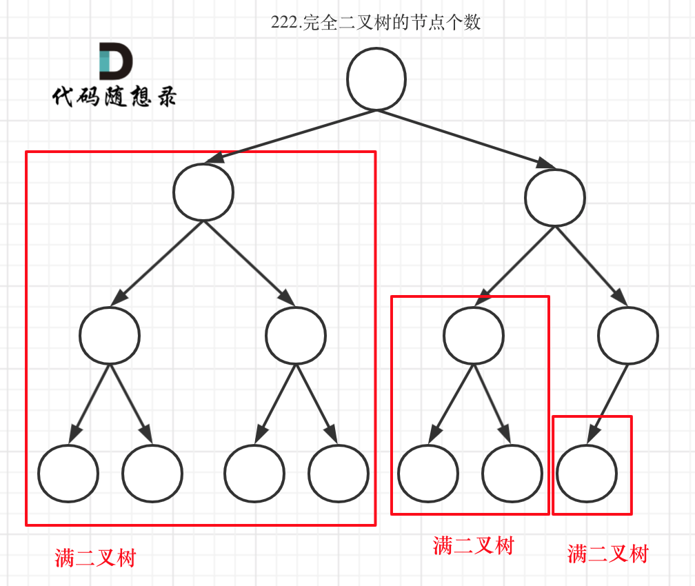

## Tree

### 1. 二叉树的最大深度 #104

思路：
- 如何理解深度和高度？

```
    1        深度1， 高度3
   / \
  2   3      深度2， 高度2
     / \
    4   5    深度3， 高度1
```
二叉树节点的深度：指从根节点到该节点的最长简单路径边的条数或者节点数（取决于深度从0开始还是从1开始）
二叉树节点的高度：指从该节点到叶子节点的最长简单路径边的条数或者节点数（取决于高度从0开始还是从1开始）

求深度：从上到下，一层一层加1，就是用前序遍历
求高度：从下往上，一层一层加1，就是用后序遍历

***而根节点的高度就是二叉树的最大深度***
所以，用后序也可以求最大的深度，后序遍历是最常用的方法解题

以下是递归解法，层序遍历在上一篇tree-2
```python
class Solution:
    def maxDepth(self, root: Optional[TreeNode]) -> int:
        return self.helper(root)
    # 用后序求最大深度
    def helper(self, root):
        if root is None:
            return 0
        left_deep = self.helper(root.left)
        right_deep = self.helper(root.right)
        return max(left_deep, right_deep)+1

```

#599 n叉树求最大的深度, 跟上面的思路是一样的
n叉树的构造是
```python
class Node:
    def __init__(self, val=None, children=None):
        self.val = val
        self.children = children

    def maxDepth(self, root: 'Node') -> int:
        return self.traveral(root)

    def traveral(self, root):
        if root is None:
            return 0
        deep = 0
        for child in root.children:
            deep_level = self.traveral(child)
            if deep_level > deep:
                deep = deep_level
        return deep + 1
```

### 2. 二叉树的最小深度 #111

给定一个二叉树，找出其最小深度。最小深度是从根节点到最近叶子节点的最短路径上的节点数量。
本题依然是前序遍历和后序遍历都可以，前序求的是深度，后序求的是高度。

思路：
- 那么使用后序遍历，其实求的是根节点到叶子节点的最小距离，就是求高度的过程，不过这个最小距离 也同样是最小深度，也是用后序遍历来做
- 最小深度是从根节点到最近叶子节点的最短路径上的节点数量。注意是叶子节点。不是空节点。***什么是叶子节点，左右孩子都为空的节点才是叶子节点！***

```python
class Solution:
    def minDepth(self, root: Optional[TreeNode]) -> int:
            return self.depthHelper(root)
    def depthHelper(self, root):
        if root is None:
            return 0
        left_deep = self.depthHelper(root.left) 
        right_deep = self.depthHelper(root.right) 
        # 要找到两个子节点都不为空的节点,如果有一个为空，就去计算另一个的深度，这时并不是最低点
        # 这个还是终止条件
        if root.left is not None and root.right is None:
            return left_deep + 1
        if root.right is not None and root.left is None:
            return right_deep + 1
        # 左右子节点都不为空的时候
        return min(left_deep,right_deep)+1

```

### 3. 完全二叉树的节点个数 #222

思路：
- 用任意的遍历都可以做到，每个节点遍历一遍，当成普通二叉树。
- 如何利用完全二叉树的特性来做，在完全二叉树中，除了最底层节点可能没填满外，其余每层节点数都达到最大值，并且最下面一层的节点都集中在该层最左边的若干位置。若最底层为第 h 层，则该层包含 1~ 2^(h-1)  个节点。

    - 完全二叉树只有两种情况，情况一：就是满二叉树，情况二：最后一层叶子节点没有满。

    - 对于情况一，可以直接用 2^树深度 - 1 来计算，注意这里根节点深度为1。

    - 对于情况二，分别递归左孩子，和右孩子，递归到某一深度一定会有左孩子或者右孩子为满二叉树，然后依然可以按照情况1来计算。
    
    - 在完全二叉树中，如果递归向左遍历的深度等于递归向右遍历的深度，那说明就是满二叉树。
    

```python
class Solution:
    def countNodes(self, root: Optional[TreeNode]) -> int:
        return self.getCount(root)
    def getCount(self, root):
        if root is None:
            return 0

        # 如果这个节点不为空的话，需要知道他是不是满二叉树
        left = root.left        # 定义两个指针
        right = root.right      # 定义两个指针
        deep_left = 1
        deep_right = 1
        while left is not None: # 求左边的深度
            deep_left += 1
            left = left.left
        while right is not None:# 求右边的深度
            deep_right += 1
            right = right.right
        if deep_left == deep_right:
            return 2 ** deep_left - 1
        count_left = self.getCount(root.left)
        count_right = self.getCount(root.right)
        return count_left + count_right + 1
```

简短的写法
```python
class Solution: # 利用完全二叉树特性
    def countNodes(self, root: TreeNode) -> int:
        if not root: return 0
        count = 1
        left = root.left; right = root.right
        while left and right:
            count+=1
            left = left.left; right = right.right
        if not left and not right: # 如果同时到底说明是满二叉树，反之则不是
            return 2**count-1
        return 1+self.countNodes(root.left)+self.countNodes(root.right)  
```