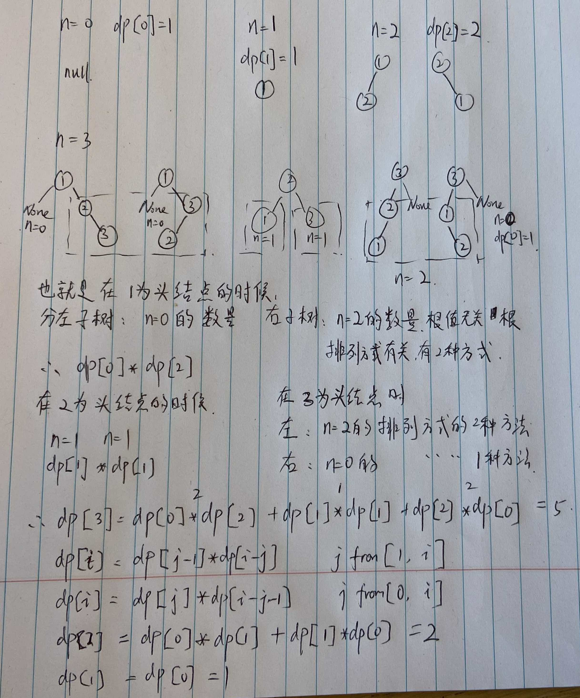

## 动态规划 day3

### 1. 整数拆分 #343

2  1X2 = 2
3  2X1 = 2
4  3+1, 3 , 2+2, 4
5  1,4 =4 2,3 = 6 
6  1,5 = 5 2,4 = 8 3,3 = 9


思路有点复杂：
1. 确定dp数组（dp table）以及下标的含义dp[i]：分拆数字i，可以得到的最大乘积为dp[i]。
2. 确定递推公式:其实可以从1遍历j，然后有两种渠道得到dp[i].
    - 一个是j * (i - j) 直接相乘。
    - 一个是j * dp[i - j]，相当于是拆分(i - j)，对这个拆分不理解的话，可以回想dp数组的定义。
也可以这么理解，j * (i - j) 是单纯的把整数拆分为两个数相乘，而j * dp[i - j]是拆分成两个以及两个以上的个数相乘。
3. 这里我只初始化dp[2] = 1
4. 确定遍历顺序

```python
class Solution:
    def integerBreak(self, n: int) -> int:
        dp = [0] * (n+1)
        dp[0] = dp[1] =0
        dp[2] = 1
        for i in range(3, n+1):
            # 因为拆分一个数n 使之乘积最大，那么一定是拆分成m个近似相同的子数相乘才是最大的。
            # 例如 6 拆成 3 * 3， 10 拆成 3 * 3 * 4。 100的话 也是拆成m个近似数组的子数 相乘才是最大的。
            # 只不过我们不知道m究竟是多少而已，但可以明确的是m一定大于等于2，既然m大于等于2，也就是 最差也应该是拆成两个相同的 可能是最大值。
            # 那么 j 遍历，只需要遍历到 n/2 就可以，后面就没有必要遍历了，一定不是最大值。
            for j in range(1,i//2+1):
                dp[i] = max(j*(i-j), j*dp[i-j], dp[i])
                # 加dp[i]的原因是：在j的循环遍历中，因为dp[i]是时时刻刻在变化的，得记录每次遍历的最大值。加上dp[i]的最大作用并不是去与dp[i]的初始值比较，而是遍历j过程进行比较
                # print(i,j,j*(i-j),j*dp[i-j],dp[i])
        return dp[n]
```

### 2. 不同的二叉搜索树 #96



如何推导的过程：
dp[3]，就是 元素1为头结点搜索树的数量 + 元素2为头结点搜索树的数量 + 元素3为头结点搜索树的数量

元素1为头结点搜索树的数量 = 右子树有2个元素的搜索树数量 * 左子树有0个元素的搜索树数量

元素2为头结点搜索树的数量 = 右子树有1个元素的搜索树数量 * 左子树有1个元素的搜索树数量

元素3为头结点搜索树的数量 = 右子树有0个元素的搜索树数量 * 左子树有2个元素的搜索树数量

有2个元素的搜索树数量就是dp[2]。

有1个元素的搜索树数量就是dp[1]。

有0个元素的搜索树数量就是dp[0]。

所以dp[3] = dp[2] * dp[0] + dp[1] * dp[1] + dp[0] * dp[2]

1. 确定dp数组（dp table）以及下标的含义 ， dp[i] ： 1到i为节点组成的二叉搜索树的个数为dp[i]。

也可以理解是i个不同元素节点组成的二叉搜索树的个数为dp[i] ，理解为以1，2，3，4...i为节点组成的二叉搜索树的个数

2. 递推公式： dp[i] += dp[以j为头结点左子树节点数量] * dp[以j为头结点右子树节点数量]

j相当于是头结点的元素，从1遍历到i为止。j遍历，从哪开始遍历到哪呢？从1开始，(j=1, i-1),(j=2,i-2),(j=3,j-3)...(j=i-1,1)

所以递推公式：dp[i] += dp[j - 1] * dp[i - j]; ，j-1 为j为头结点左子树节点数量，i-j 为以j为头结点右子树节点数量, 递推公式公式还有点点混乱。为什么是从j-1和i-j？

3. dp数组如何初始化 : dp[0] =1 从定义上来讲，空节点也是一棵二叉树，也是一棵二叉搜索树，这是可以说得通的。

4. 确定遍历顺序: 从左到右


```python
class Solution:
    def numTrees(self, n: int) -> int:
        dp = [0] * (n+1)
        dp[0] = 1

        for i in range(2,n+1):
            for j in range(1,i+1):
                dp[i] += dp[j-1]*dp[i-j]
        # print(dp)

        return dp[n]
```