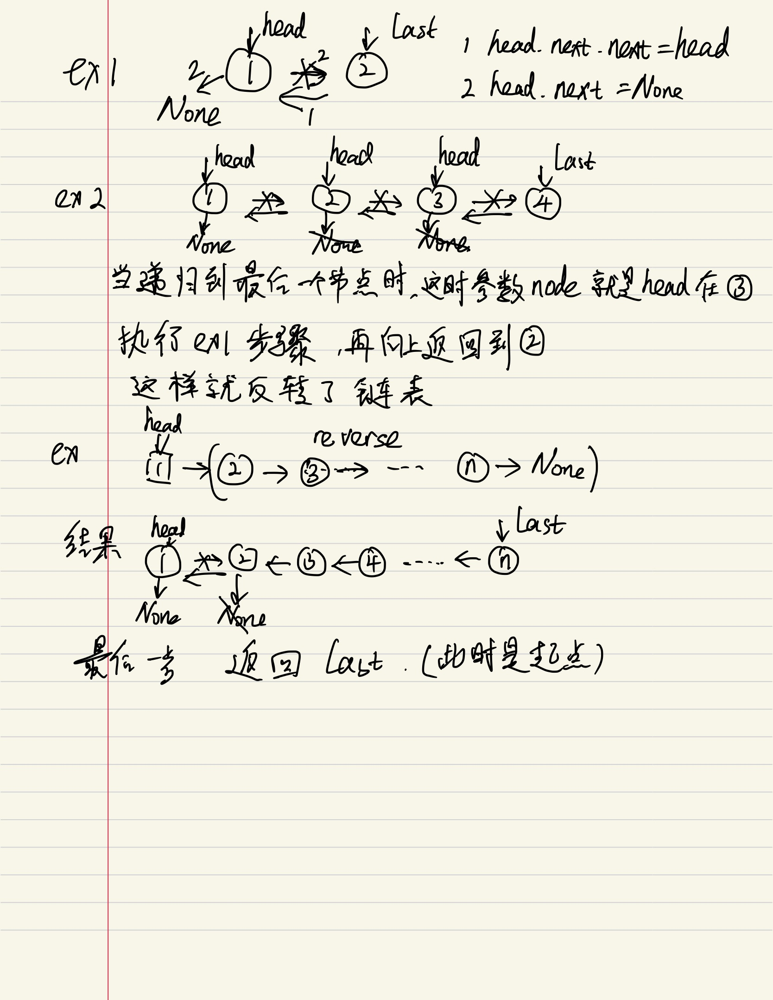

## 203 remove linked list element

思路：
- 如果这个元素不是要删的元素，next等于这个元素，并且移动指针到这个元素
- 如果这个元素是要删的元素，next等于这个元素的下一个元素，不移动指针，也就是next会一直变，直到出现第一种情况才移动指针

```python

class Solution:
    def removeElements(self, head: Optional[ListNode], val: int) -> Optional[ListNode]:
        # 如果出现一直是要删除的元素，怎么办，不是马上指向下一个，而是用双指针
        # 如果头节点就是要删除的元素呢？创建一个dummy node，然后把头节点当成是第二个节点删除
        dummy_node = ListNode(-1)
        pointer = dummy_node
        while head:
            if head.val is not val:
                # 不是要删除的节点，指向这个节点
                pointer.next = head
                pointer = pointer.next
            else:
                pointer.next = head.next
            head = head.next
        return dummy_node.next
```

## 206 reverse linked list

思路：
- 很简单，就是双指针，把每个元素的指针反转
- 下面会有详细介绍
```python
class Solution:
    def reverseList(self, head: Optional[ListNode]) -> Optional[ListNode]:
        pre = None
        current = head
        while current:

            next_node = current.next
            current.next = pre
            pre = current
            current = next_node

        return pre
```

## 24 Swap node in pairs

思路：
- 做链表的时候，如果想处理当前节点的指向，一定要从前一个节点开始操作，也就是前一个节点的指向变成当前节点的下一个节点，那么当前节点就可以空出来了，对吧？
- 重点：如果要把两个节点相交换，那么开始的位置一定是前一个节点，也就是每次循环的时候，指针都指向的是要交换的两个节点的前一个节点
- 关键点：因为交换之后会改变指针方向，那么把之前的节点需要保存下来，保存哪个节点？好好想想。
- 细节问题：就是循环的终止条件是什么？我创建了一个dummy节点之后
    - 终止条件一定是当前节点的后两个要交换的两个节点不为空，那么就分奇数还是偶数，奇数的话，就是要交换的节点的第二个节点为空，那么就终止，偶数的话，要交换的第一个节点就为空，也终止
    - 另外一个问题就是如果本身head就是空呢？因为我们有了头节点，所以dummy的next就是head，也符合终止条件的判断，那么就是不用在前面去判断head是不是空了。太神了

画图如下：


了解了思路，代码一气呵成
```python
class Solution:
    def swapPairs(self, head: Optional[ListNode]) -> Optional[ListNode]:

        dummy = ListNode(-1)
        dummy.next = head
        cur = dummy
        while cur.next and cur.next.next:
            node1 = cur.next
            node2 = node1.next.next
            cur.next = node1.next
            cur.next.next = node1
            node1.next = node2
            cur = cur.next.next

        return dummy.next
```

## 19 Remove Nth node from end of list

思路：
- 双指针的经典应用，如果要删除倒数第n个节点，让fast移动n步，然后让fast和slow同时移动，直到fast指向链表末尾。删掉slow所指向的节点就可以了。
- 这道题也是需要一个dummy node放在head之前，那么就可以处理只有一个节点和两个节点的情况了。
    - 例如只有一个节点，n=1，cur1到node的时候，cur2还在dummy，cur2.next = cur2.next.next就可以用了
- 细节：另外这道题也考察，我是吧cur2移动n还是n+1

```python
class Solution:
    def removeNthFromEnd(self, head: Optional[ListNode], n: int) -> Optional[ListNode]:
        dummy = ListNode(-1)
        dummy.next = head
        cur1 = dummy # 指针用来做n的计数的
        cur2 = dummy

        for _ in range(n): #如果这里是n+1
            cur1 = cur1.next
        
        while cur1 and cur1.next: #如果上面是n+1，这里只需要判断cur1不是空就好
            cur2 = cur2.next
            cur1 = cur1.next
        cur2.next = cur2.next.next
        return dummy.next
```

## 92 Reserve linked list II, 206 Reserved whole linked list, Reserved first N linked list
思路：
- 反转链表分三种，层层递进，反转整个链表，反转前N个节点，反转中间部分节点
- 基础方法是用两个pointer做反转，会出现很多细节上的问题。
- 另一个思路就是用递归方法的做链表反转

递归reserve方法：
```python
        # 递归反转链表
        def reserve(node, 1):
            if node is None or node.next is None:
                return node
            last = reserve(node.next)
            node.next.next = node
            node.next = None
            return last  
```

原理如下图：


## 第一种 先看反转整个链表 #206
两种方法，
```python
class Solution:
    def reverseList(self, head: Optional[ListNode]) -> Optional[ListNode]:

        # recusive 方法
        return self.reserve(head)
    def reserve(self,node):
        if node is None or node.next is None:
            return node
        last = self.reserve(node.next)
        node.next.next = node
        node.next = None
        return last

        
        # pointer方法
        dummy = None
        pre = head
        while pre:
            temp = pre.next
            pre.next = dummy
            dummy = pre
            pre = temp
        return dummy
```

## 第二种：反转链表前 N 个节点
需要一个图
```C++
// 将链表的前 n 个节点反转（n <= 链表长度）
ListNode successor = null; // 后驱节点,把反转之后和这个N+1的节点连上，上面全部节点反转的时候就是None

// 反转以 head 为起点的 n 个节点，返回新的头结点
ListNode reverseN(ListNode head, int n):
    if (n == 1) { 
        // 记录第 n + 1 个节点
        successor = head.next;
        return head;
    }
    // 以 head.next 为起点，需要反转前 n - 1 个节点
    ListNode last = reverseN(head.next, n - 1);

    head.next.next = head;
    // 让反转之后的 head 节点和后面的节点连起来
    head.next = successor; // 之前的方法就是head.next = None
    return last;
```

具体的区别：

1、base case 变为 n == 1，反转一个元素，就是它本身，同时要记录后驱节点。

2、刚才我们直接把 head.next 设置为 null，因为整个链表反转后原来的 head 变成了整个链表的最后一个节点。但现在 head 节点在递归反转之后不一定是最后一个节点了，所以要记录后驱 successor（第 n + 1 个节点），反转之后将 head 连接上。

## 第三种：反转部分链表 #92

```python

# 完整解题：
class Solution:
    def reverseBetween(self, head: Optional[ListNode], left: int, right: int) -> Optional[ListNode]:

        if left == 1:
            # self.successor = None #也可以在这里定义一个全局变量
            return self.reverseN(head, right) #这里注意别忘了return
        head.next = self.reverseBetween(head.next, left-1, right-1)
        return head
        
    # 递归反转链表
    def reverseN(self, head: ListNode, n: int) -> ListNode:
        global successor
        if n == 1:
            # 记录第 n + 1 个节点
            successor = head.next
            return head
        # 以 head.next 为起点，需要反转前 n - 1 个节点
        last = self.reverseN(head.next, n - 1)

        head.next.next = head
        # 让反转之后的 head 节点和后面的节点连起来
        head.next = successor
        return last
    # 自己写的，和上面的基本一样
    def reverseN(self,node, n):
        # connect_node = None
        if n == 1:
            self.successor = node.next
            return node
        last = self.reverseN(node.next, n-1)
        node.next.next = node
        node.next = self.successor
        return last  
```
- head.next 指的是当前节点 head 的下一个节点。
- head.next 被作为新的 head 传递给递归调用 reverseBetween。
- 递归调用 reverseBetween(head.next, m - 1, n - 1) 使用下一个节点作为新的 head，并将 m - 1 和 n - 1 作为新的索引。
- 递归调用从下一个节点开始反转链表，直到 m - 1 个节点（不包括）。
- 从递归调用返回的反转链表被返回。
- head.next 被更新为返回的反转链表。
- 更新后的 head 被返回，它将连接反转后的链表到原始链表的其余部分。

```python
class Solution:
    def reverseBetween(self, head: Optional[ListNode], left: int, right: int) -> Optional[ListNode]:

        # 第二种方法 ，双指针
        # head是空，或者左右节点的位置相等，就直接返回
        if not head or left == right:
            return head
        dummy = ListNode(0, head)
        prev = dummy
        for _ in range(left-1):
            prev = prev.next
        current = prev.next

        for _ in range(right-left):
            node_next = current.next # 这行代码将当前节点的下一个节点赋值给 next_node。这是为了保存要交换的下一个节点，以便后面进行交换。
            current.next = node_next.next #这行代码将当前节点的下一个节点更新为 next_node 的下一个节点。这是为了将要交换的节点从链表中移除。
            node_next.next = prev.next # 这里不能指向current，因为current不变，而prev.next 随之在变， 这行代码将 next_node 的下一个节点更新为 prev 的下一个节点。这是为了将 next_node 插入到链表中正确的位置。
            prev.next = node_next # 这行代码将 prev 的下一个节点更新为 next_node。这是为了将 next_node 连接到链表中正确的位置。
        
        return dummy.next
```
双指针也需要一个图

## 最后总结
递归的思想相对迭代思想，稍微有点难以理解，处理的技巧是：不要跳进递归，而是利用明确的定义来实现算法逻辑。

处理看起来比较困难的问题，可以尝试化整为零，把一些简单的解法进行修改，解决困难的问题。

值得一提的是，递归操作链表并不高效。和迭代解法相比，虽然时间复杂度都是 O(N)，但是迭代解法的空间复杂度是 O(1)，而递归解法需要堆栈，空间复杂度是 O(N)。所以递归操作链表可以作为对递归算法的练习或者拿去和小伙伴装逼，但是考虑效率的话还是使用迭代算法更好。

